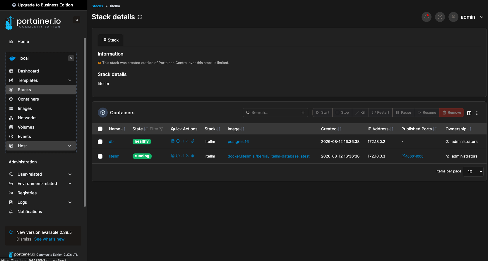
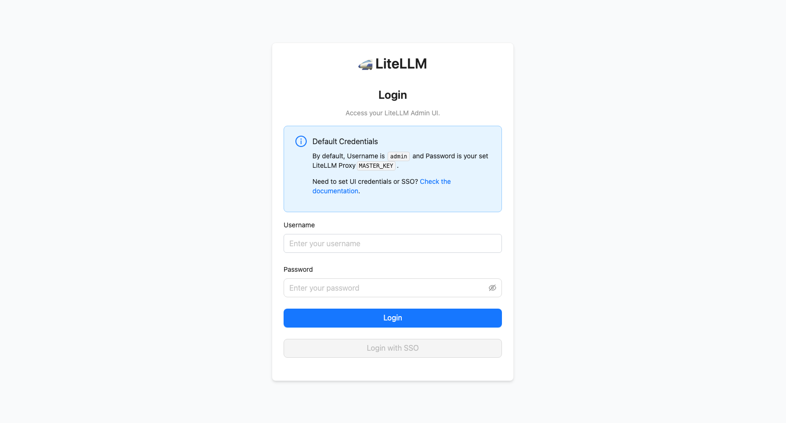
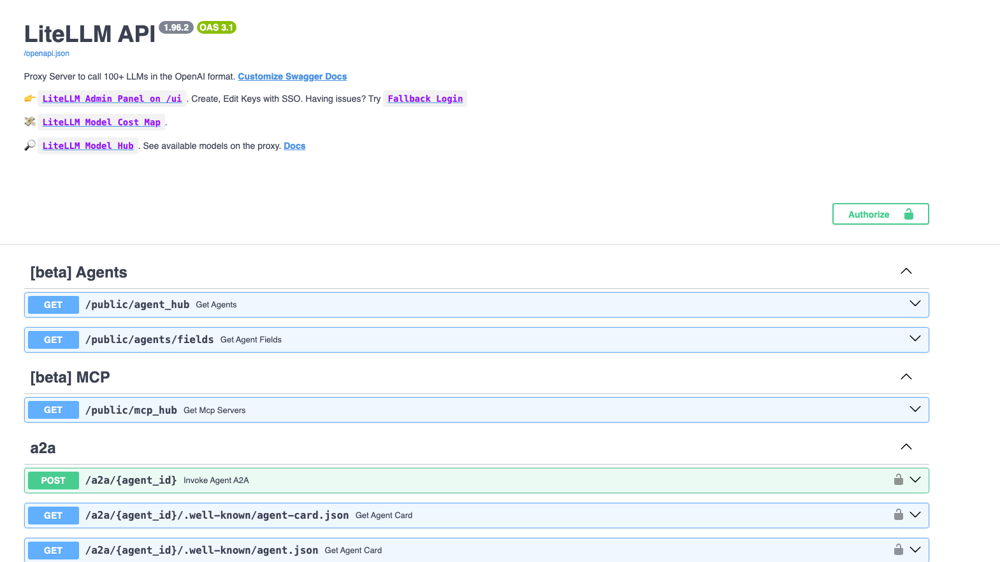
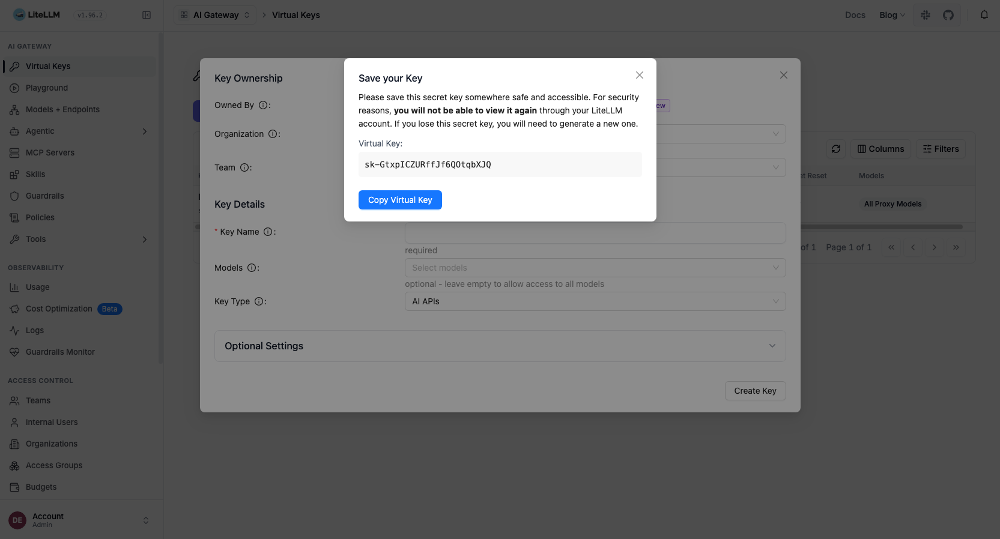
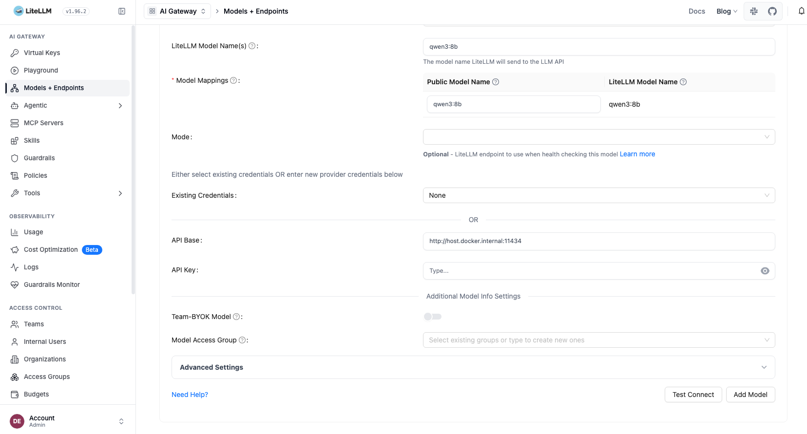

# Description
Configure claude code to use ollama models throw LiteLLM AI Gateway UI.

## Steps

- **STEP01**: Deploy/Remove LiteLLM Proxy Server. \
To deploy LiteLLM Proxy Server using Docker.
```shell
$ docker compose up -d
```



To remove LiteLLM stack and volumes
```shell
$ docker compose down -v
```

After deployed, we can open the UI using default credentials: **admin/sk-1234** at http://localhost:4000/ui



If we want develop using any SDK we have the LiteLLM Swagger API documentation at http://localhost:4000



- **STEP02**: Create an API_KEY. \
Create an API_KEY to be used by Claude Code from LiteLLM UI



- **STEP03**: Add LLM Models. \
Add model `qwen3:8b` using the Ollama Chat provider from Models + Endpoints from LiteLLM UI:



If you installed ollama natively in your host, you must use this uri to configure your model API Base: `http://host.docker.internal:11434`. If you have some problems when test this uri, use your host IP (Be carefull if this one is dynamic).

- **STEP4**: Install Claude Code TUI. \
Install Claude Code TUI in your host as usual:
```shell
$ curl -fsSL https://claude.ai/install.sh | bash
```

- **STEP5**: Configure Claude Code. \
Create Claude Code code base configuration file. First create your code base directory when your project code will be and inside, configure Claude Code configuration file called settings.json, to connect to LiteLLM Proxy server and use its LLM published models.
```
{
  "env": {
    "ANTHROPIC_BASE_URL": "http://<LITELLM_HOST>:4000",
    "ANTHROPIC_AUTH_TOKEN": "<LITELLM_API_KEY>",
    "ANTHROPIC_MODEL": "<LITE_LLM_MODEL_ID>"
  }
}
```